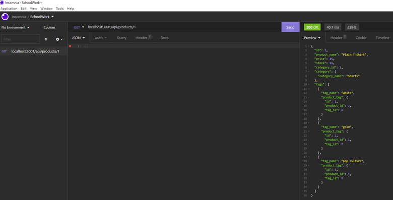

# Online Business

## Table of Contents

[description](#description)
[installation](#installation)
[license](#license)
[usage](#usage)
[contribution](#contribution)
[questions](#questions)

## Description

This e-commerce back-end application is a tool to help the user manage an online business through connecting to a SQL database using Sequelize. The database is seeded with test data. Using a command from the command line prompt, the server is started, and the models are synced so that the user can retrieve, add, modify or delete items from the database. These items include categories, products and product tags, all very necessary items for the online business manager to keep track of.

## Badges

## Installation

This application can be copied and installed with care to keeping its folder structure.

## License

MIT

## Usage

This application is designed for an online business manager to have command of their products, products tags, and product categories. The manager may view all, select one to view, or add a new product, products tag, or product category. They also may be modified or deleted.

## Contribution

Todd Trulock helped me with insomnia and how to make the video with a length of no more than 5 minutes.

## Questions

### GitHub Username: cnc500

### GitHub Repository: onlineBusiness

### Email: cncarnevale@gmail.com

## Screenshot

## Video URL

https://drive.google.com/file/d/1AYmuCk6vEMZ8f8U_COhl3nWqLYOcx_Cu/view?usp=sharing
